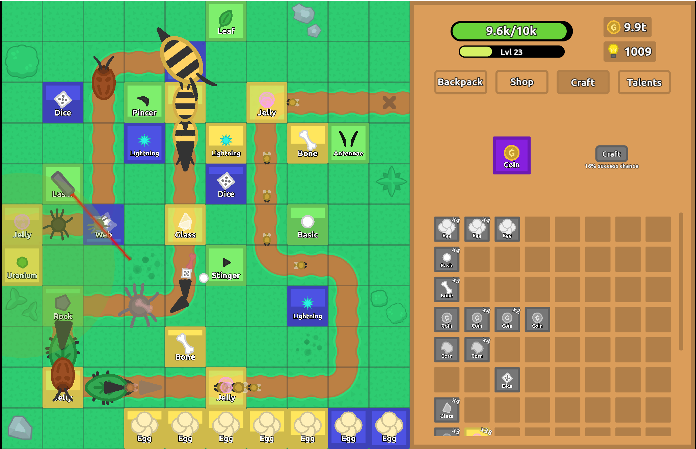

# Florr Defence


**Florr Defence** is a tower-defence game inspired by the cards,
petals, enemies, and rarity progression of [florr.io](https://florr.io/). Build a
defence, getting powerful petals from shops, crafting, and talents, and survive increasingly
dangerous enemy waves.


> [!NOTE]
> The game is NOT under active development. The current configuration is still unbalanced.
> Unfortunately I do not have time to balance the configuration. I will be thankful if you are willing to help (see [Contributing](#contributing) below)!


## Screenshots





## How to Play?

You can download this game from [itch.io](https://github.com/YunTianZhou/FlorrDefence/tree/main#building-from-source).

## Gameplay


Enemy mobs follow the path toward your flower. Place cards on compatible map tiles
to create attacking, defensive, summoning, or support towers. Defeated enemies
award coins and experience that can be invested into new cards and permanent
talent upgrades.


Current game include:

- Attacking, defensive, summoning, multishot, and buff towers
- 14 enemy types, including specialized enemies and bosses
- All 8 rarities for towers, enemies, and talents
- A rotating shop, card crafting, backpack, and a talent tree
- Automatic and manual JSON saves, including Save As and Open dialogs

## Controls


| Input | Action |
| --- | --- |
| Left click / drag | Select cards, interact with menus, and place or move towers |
| Right click a backpack card | Automatically place one card |
| Shift + right click a backpack card | Automatically place as many cards from that stack as possible |
| Right click a tower | Remove it and return its card to the backpack |
| Shift + right click a tower | Remove every matching tower |
| Shift + click a shop item | Buy the maximum affordable amount |
| Mouse wheel | Scroll the active backpack, shop, crafting, or talent panel |
| Ctrl + S | Save to the configured default path while alive |
| Ctrl + Shift + S | Save As while alive |
| Ctrl + O | Open a save file |
| Hold G | Show petal rarity |
| Hold H | Show enemy rarity |


## User Settings


On first launch, the game copies
[`settings_default.json`](FlorrDefence/res/config/settings_default.json) to
`settings.json` in the working directory.


| Setting | Default | Purpose |
| --- | ---: | --- |
| `load_path_default` | `FlorrDefence.json` | Save loaded when the game starts |
| `save_path_default` | `FlorrDefence.json` | Destination used by Ctrl + S and autosave |
| `auto_save_enabled` | `true` | Enables periodic saving |
| `auto_save_interval_seconds` | `60` | Time between autosaves |
| `vsync_enabled` | `true` | Requests display-synchronized rendering; a 60 FPS fallback is used when unavailable |
| `show_console` | `false` | Shows the console window on Windows |
| `debug_mode` | `false` | Enables FPS output and development shortcuts |


## Game Record Management

Game records are JSON save files containing your player progress, backpack, map,
shop, and talents. On startup, the game loads `load_path_default` from
`settings.json` (`FlorrDefence.json` by default). If that file does not exist, a
new game starts. Relative paths are resolved from the game's working directory.

- **Save:** Ctrl + S writes to `save_path_default`. The game automatically saves when you close the window.
  Autosave uses the same path every 60 seconds by default. **Both work only while you are alive.**
- **Save a checkpoint:** Ctrl + Shift + S opens Save As to save a separate JSON
  file while you are alive.
- **Load a checkpoint:** Ctrl + O opens a record and replaces the current run.
  Save any progress you want to keep before opening another record.

Save As and Open do **not** change `load_path_default` or `save_path_default`.
Later autosaves and Ctrl + S still overwrite the configured save destination.
Continuing after game over reloads `load_path_default`.

A simple way to manage records is to keep one active save and separate backups:

1. Set both default paths in `settings.json` to the same file, such as
   `saves/main.json`, then restart the game to apply the settings.
2. Use Save As for named checkpoints, such as `saves/backups/main-level-50.json`,
   before trying a new build or changing game balance. Keep autosave pointed at
   the active save so it does not overwrite those checkpoints.
3. To switch to another run permanently, close the game, set both default paths
   to that run's file, and relaunch. To start fresh, use a new, unused filename.

> [!WARNING]
> **Save before quitting**; closing the window does not trigger a dedicated save.
> Keep copies of important records outside the game/build directory before
> replacing a download or cleaning a build.


## Customization

Gameplay data is stored as JSON in [`res/config`](FlorrDefence/res/config).
Close the game, back up the file you want to change, edit it in a text editor,
and relaunch to load the changes. Keep the existing JSON structure, field names,
and value types; change a few values at a time and try them in a separate save.

For a downloaded or built game, edit the `res/config` folder beside the
executable. For changes you want to keep in source control, edit
`FlorrDefence/res/config` and copy the updated files into the build's `res/config`
folder, or rebuild so the post-build resource copy runs. Rebuilding can replace
edits made only in the output folder.

- [init_states.json](FlorrDefence/res/config/init_states.json): Starting health, level, cards, coins, and talent points; applies to new games.
- [tower_attribs.json](FlorrDefence/res/config/tower_attribs.json): Attributes for each tower and rarity.
- [mob_attribs.json](FlorrDefence/res/config/mob_attribs.json): Attributes for each mob and rarity.
- [shop_attribs.json](FlorrDefence/res/config/shop_attribs.json): Shop contents and refresh intervals.
- [talent_attribs.json](FlorrDefence/res/config/talent_attribs.json): Talent buffs and costs.
- [mob_spawn_config.json](FlorrDefence/res/config/mob_spawn_config.json): Mob spawning for each level.
- [tower_descrption.json](FlorrDefence/res/config/tower_descrption.json): Text displayed when hovering over a tower.
- [talent_description.json](FlorrDefence/res/config/talent_description.json): Text displayed when hovering over a talent.
- [settings_default.json](FlorrDefence/res/config/settings_default.json): Defaults copied into `settings.json` on first launch. Edit the existing `settings.json` for your own save paths, autosave, and display preferences (see [User Settings](#user-settings)).

For example, change `coin` in `init_states.json` to adjust the starting coins,
then launch with an unused `load_path_default` and matching `save_path_default`
to test a new game without overwriting your main record.


## Building from source


### Requirements


- A C++20 compiler
- CMake 3.22 or newer on Linux, or CMake 3.24 or newer on Windows
- Git
- The platform development libraries required by SFML/OpenGL


### Windows


Run these commands from an x64 Native Tools command prompt with Ninja available:


```powershell
git clone --recurse-submodules https://github.com/YunTianZhou/FlorrDefence.git
cd FlorrDefence
cmake --preset x64-release
cmake --build out/build/x64-release
cd out/build/x64-release/FlorrDefence
./FlorrDefence.exe
```


The build copies the `res` directory beside the executable. Run the game from
that output directory because assets and configuration files are resolved from
the current working directory.


### Linux


> [!WARNING]
> This game may have a big performance issue on Linux, we recommand playing it on Windows.


```bash
git clone --recurse-submodules https://github.com/YunTianZhou/FlorrDefence.git
cd FlorrDefence
cmake -S . -B build -DCMAKE_BUILD_TYPE=Release
cmake --build build --parallel
cd build/FlorrDefence
./FlorrDefence
```


## Contributing

Currently the game configurations are still incomplete and unbalanced.

- Tower/Mob are missing certain rarities.
- Talent is not balanced.
- Mob spawning is not balanced. It either feels too boring or overwhelming.

You can help by:

- Reporting bugs
- Assisting with balancing configurations
- Improving game mechanics
- Help improve this page (e.g. write a game guide)
- Any other way you can think of!

Bug reports and focused pull requests are welcome.
When reporting a problem, include your operating system, compiler, build type, reproduction steps, and any
console output. Keep gameplay-data changes separate from engine changes where
possible so balancing differences are easy to review.

## Attribution

**Florr Defence is an independent fan project inspired by florr.io and is not
affiliated with its creators.** It uses
[SFML](https://www.sfml-dev.org/),
[nlohmann/json](https://github.com/nlohmann/json),
[portable-file-dialogs](https://github.com/samhocevar/portable-file-dialogs),
[Cornered](https://github.com/metaquarx/Cornered), and
[RichText](https://github.com/skyrpex/RichText/).
